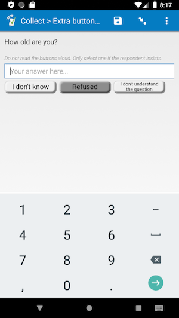

# Extra button append

This SurveyCTO plug-in is based on [extra-button plug-in](https://github.com/surveycto/extra-buttons). This plug-in allows adding additional characters to the existing responses instead of replacing them.

## Description

Use this field plug-in to add extra buttons to your text, integer, or decimal field. If there is already something in the text box when pressing a button, the button's text will be added at the end of the existing answer.

You can specify exactly what each button says, and what its value should be (for example, you can specify that when "Square root" is selected, then the field has a √). You can use the parameters to specify as many buttons as you would like. The label of the button selected will be stored in the metadata for that field.

This field plug-in also inherits functionality from the [baseline-text](https://github.com/surveycto/baseline-text), [baseline-integer](https://github.com/surveycto/baseline-integer), and [baseline-decimal](https://github.com/surveycto/baseline-decimal) field plug-ins.

### Features

* Add extra buttons to *text*, *integer*, and/or *decimal* field.
* Customize button value and text
* Add as many buttons as needed
* Warning if button pressed when field has a value

### Data format

If a button is not used, then the data will be whatever is in the text box. When a button is used (and confirmed if applicable), then the value of that button (as specified in the parameters) is set as the field value.

You can also retrieve the label of the button selected using the SurveyCTO plug-in-metadata() function.

## How to use

### Getting started

1. Download the [sample form](extras/readme-images/sample-form) from this repo and upload it to your SurveyCTO server.
1. Download the [extrabuttons.fieldplugin.zip](https://github.com/ARCED-Foundation/extra-buttons-append/raw/master/extrabuttons-append.fieldplugin.zip) file from this repo, and attach it to the sample form on your SurveyCTO server.
1. Adjust the parameter if you would like to use a different unit (see below).

### Parameters

For each extra button you would like to add, you will need a label, called "button", and a "value". For the parameter name, take the parameter name, and add the button number. For example, the parameter for the label of the first button will be `button1`, the parameter for the label of the second button will be `button2`, and so on. The parameter for the value for the first button will be `value1`, the parameter for the value of the second button will be `value2`, and so on. So, if you wanted one button with the label "I don't know" and a value of `-99`, and another button with a label of "Refused" and a value of -88, you would use this *appearance*:

    custom-extrabuttons(button1="I don't know", value1=-99, button2='Refused', value2=-88)

You can add as many or as few buttons as you'd like.

Be sure to update your *constraint* so it accepts the button values as values.

### Default SurveyCTO feature support

| Feature / Property | Support |
| --- | --- |
| Supported field type(s) | `text`, `integer`, `decimal`|
| Default values | Yes |
| Custom constraint message | Yes |
| Custom required message | Yes |
| Read only | Yes |
| media:image | Yes |
| media:audio | Yes |
| media:video | Yes |
| `number` appearance | Yes |
| `numbers_decimal` appearance | Yes |
| `numbers_phone` appearance | Yes |
| `show_formatted` appearance | Yes |

## More resources

* **Sample form**  
You can find a form definition in this repo here: [extras/sample-form/sample-form](extras/sample-form/Extra buttons append.xlsx).

* **Developer documentation**  
More instructions for developing and using field plug-ins can be found here: [https://github.com/surveycto/Field-plug-in-resources](https://github.com/surveycto/Field-plug-in-resources)
